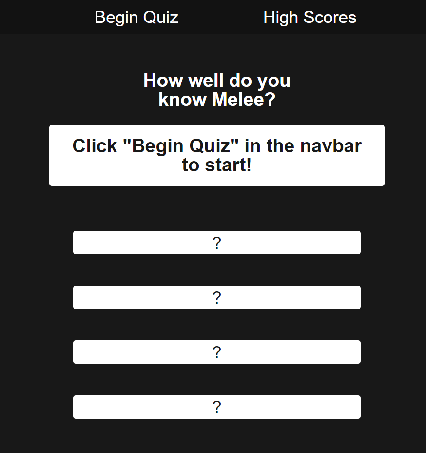

# <ssbm-quiz>

## Description

This project was built to test my javascript dom manipulation skills, as well as basic js logic. I learned about timers and intervals, how to display js generated elements and text to page, as well as styling those elements and text. This project also taught me a ton about object, array, and local storage manipulation.

## Usage

    
    
## Screenshots
    https://pem2k.github.io/ssbm-quiz
    https://github.com/pem2k/ssbm-quiz